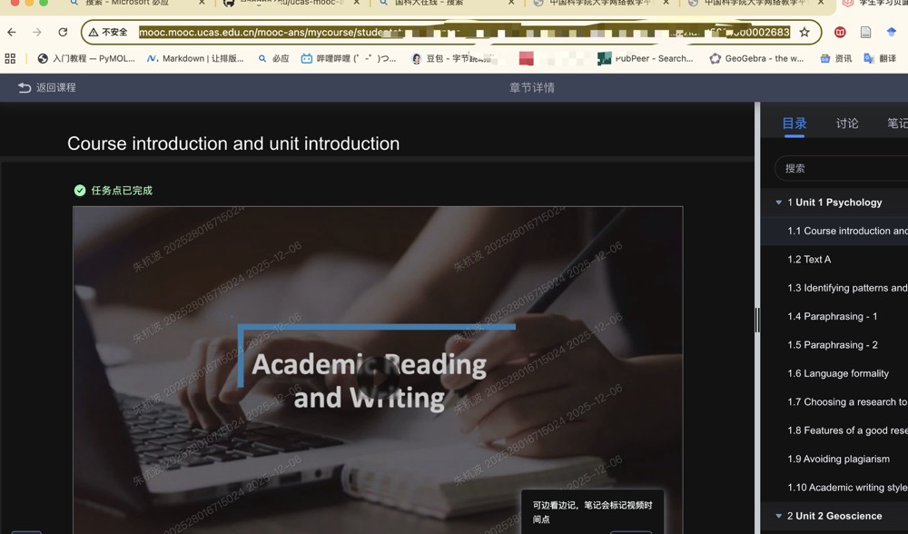

# 国科大慕课学习

一个专为中国科学院大学在线慕课平台设计的自动化学习工具，支持自动观看视频、阅读PPT，智能跳过已完成内容。
[参考自](https://github.com/CJ-xchina/ucas-mooc)
> 2025.12.6自测可用，可以自动跳过quiz，但是存在一点问题，这个ppt的任务点，有时候会完成不了，需要手动一下。

如果你觉得我这个项目有用，给个star🌟吧～

## ✨ 主要特性

- 🎯 **单实例模式**: 只需登录一次，自动处理所有章节
- 🔄 **智能进度识别**: 自动检测新旧版UI，跳过已完成章节和测验
- ⚡ **高效处理**: 支持视频倍速播放，智能跳过已观看内容
- 📄 **PPT深度阅读**: 模拟真实阅读行为，确保触发完成状态
- 🖥️ **跨平台支持**: 适配macOS和Windows系统
- 📊 **进度可视化**: 实时显示视频播放进度条

## 🚀 快速开始

### 步骤1：环境准备

确保你的计算机上已经安装了 Python (3.7+) 和 pip ，谷歌浏览器等工具。

### 步骤2：安装依赖包

在虚拟环境中运行以下命令安装代码所需的依赖包：

```bash
pip install -r requirements.txt
```

**主要依赖：**
- `selenium==4.15.2` - 网页自动化框架
- `numpy==1.26.2` - 数值计算支持
- `PyAutoGUI==0.9.54` - 鼠标键盘控制
- `tqdm==4.66.1` - 进度条显示

### 步骤3：获取课程URL

> **重要：需要手动配置课程URL到代码中**

1. 进入国科大在线网站 [中国科学院大学网络教学平台](http://mooc.ucas.edu.cn/portal)
2. 点击右上角"校内登录"
3. 选择使用手机号登录（Mooc绑定的手机号与密码）
4. 登录成功后点击右上角"个人空间"
5. 在"我学的课"中找到目标课程（如"硕士学位英语（慕课学习）"）
6. 进入课程后点击任意小节，复制浏览器地址栏的完整网址

7. **重要：** 将获取的网址替换到 `main.py` 第305行的 `url` 变量

### 步骤4：运行脚本

```bash
python main.py
```

## 💡 使用流程

1. **启动脚本后**，浏览器会自动打开并跳转到配置的课程页面
2. **手动登录**：根据提示扫码或使用账号密码登录
3. **进入章节页面**：确保能看到左侧的章节目录列表
4. **按回车开始**：确认就绪后按回车键开始全自动刷课
5. **自动处理**：脚本会自动扫描进度，处理未完成的视频和PPT

## 🔧 脚本功能详解

### 自动视频处理
- ✅ 自动播放视频，支持2倍速
- ✅ 智能跳过已完成视频（剩余时间<5秒）
- ✅ 自动防暂停检测，确保连续播放
- ✅ 实时进度条显示播放进度

### 自动PPT处理
- ✅ 深度模拟阅读（50轮滚动）
- ✅ 强制滚动到底部触发完成状态
- ✅ 增强鼠标移动兼容性

### 智能进度管理
- ✅ 自动识别新旧版UI界面
- ✅ 跳过已完成章节和测验内容
- ✅ 循环扫描确保无遗漏
- ✅ 异常恢复和重试机制

## 📋 系统要求

- **操作系统**: macOS 10.14+ / Windows 10+
- **Python版本**: 3.7 或更高版本
- **浏览器**: Chrome + ChromeDriver（建议使用最新版）
- **网络**: 稳定的互联网连接

## ⚠️ 注意事项

1. **首次使用**需要手动配置课程URL到代码中
2. **浏览器要求**需要提前安装Chrome浏览器和对应的ChromeDriver
3. **登录方式**支持手机号登录和校内登录两种方式
4. **网络稳定性**较差时可能需要手动重试
5. **建议在非高峰时段**使用，避免服务器压力过大

## 🐛 常见问题

**Q: 脚本运行时出现超时错误怎么办？**
A: 检查网络连接，确保课程页面已完全加载后再按回车开始。

**Q: 视频无法自动播放？**
A: 可能是浏览器兼容性问题，建议更新Chrome和ChromeDriver到最新版本。

**Q: PPT阅读完成后仍显示未完成？**
A: 脚本已优化PPT处理逻辑，如仍有问题可尝试手动滚动到PPT底部。

**Q: 如何确认所有章节都已处理完成？**
A: 脚本会持续循环扫描，当检测不到未完成章节时会自动结束。

---

**免责声明：** 本工具仅供学习和技术研究使用，请遵守平台使用规则和学术诚信要求。
